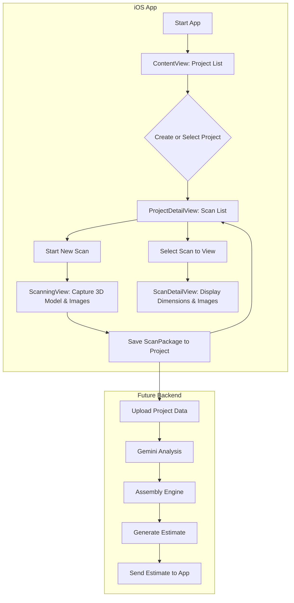

# ContractorLens Technical Architecture

## 🏗️ **Project-Based, Offline-First Scanning Pipeline**

### **Overview**
ContractorLens implements a robust, multi-phase pipeline that begins with on-device AR scanning and local persistence, creating a resilient foundation for future backend processing. The architecture is designed to be offline-first, ensuring a smooth user experience and zero data loss.

---

## 📱 **Phase 1: On-Device Data Capture & Persistence**

### **Core Models**
The data hierarchy is organized into `Projects`, which contain multiple `Scans`.

```swift
// Represents a top-level project containing multiple scans.
struct Project: Codable, Identifiable {
    let id: UUID
    var name: String
    var lastModified: Date
    var scans: [ScanPackage]
}

// A container for all data from a single scanning session.
struct ScanPackage: Codable {
    let id: UUID
    let projectName: String
    let timestamp: Date
    let capturedRoom: CapturedRoom // The 3D model from RoomPlan
    let capturedFrames: [Data]     // Images for Gemini analysis
}
```

### **Scanning & Capture Logic**
All AR and capture logic is consolidated into the `ScanningView` and its `RoomCaptureCoordinator` to ensure a single source of truth and prevent resource conflicts.

```swift
// Located in ScanningView.swift
@available(iOS 17.0, *)
class RoomCaptureCoordinator: NSObject, RoomCaptureSessionDelegate, ARSessionDelegate {
    // ...
    
    // Captures frames on a background thread to prevent UI stuttering.
    func session(_ session: ARSession, didUpdate frame: ARFrame) {
        DispatchQueue.global(qos: .background).async {
            // ... frame processing logic ...
            DispatchQueue.main.async {
                self.capturedFrames.append(pngData)
            }
        }
    }

    // Bundles and saves the data upon completion.
    func captureSession(_ session: RoomCaptureSession, didEndWith data: CapturedRoomData, error: Error?) {
        // ... error handling ...
        let scanPackage = ScanPackage(/* ... */)
        self.onScanComplete(scanPackage) // Callback to the UI
    }
}
```

### **Persistence Service**
The `ProjectPersistenceService` handles the serialization of `Project` objects to the device's local storage. It is configured to safely handle non-standard floating-point values (`NaN`) that can be produced by `RoomPlan`.

```swift
// Located in ProjectPersistenceService.swift
class ProjectPersistenceService {
    private let encoder = JSONEncoder()
    private let decoder = JSONDecoder()

    init() {
        encoder.nonConformingFloatEncodingStrategy = .convertToString(positiveInfinity: "inf", negativeInfinity: "-inf", nan: "nan")
        decoder.nonConformingFloatDecodingStrategy = .convertFromString(positiveInfinity: "inf", negativeInfinity: "-inf", nan: "nan")
        // ...
    }

    func save(project: Project) throws { /* ... */ }
    func loadProjects() -> [Project] { /* ... */ }
}
```

---

## ☁️ **Phase 2: Backend Processing (Conceptual)**

This phase outlines the future implementation for when the locally saved `ScanPackage` data is uploaded to the cloud.

1.  **Upload**: The app will upload the `Project` and its associated `ScanPackage` data to a secure backend endpoint.
2.  **AI Analysis**: The backend will forward the `capturedFrames` and room data to the **Gemini ML Service** for material and object identification.
3.  **Cost Calculation**: The results from the Gemini analysis will be fed into the **Assembly Engine**, which queries a PostgreSQL database to calculate a detailed, line-item cost estimate.
4.  **API Response**: The final estimate is sent back to the iOS app and associated with the original project.

---

## 🔄 **Data Flow Architecture**

### **End-to-End Pipeline**



---

## 🎯 **UI/UX Enhancements Implemented**

-   **Project-Based Workflow**: The entire app is now structured around projects, providing a logical and intuitive way for users to manage multiple scans.
-   **Clear Calls to Action**: Empty states in the project and scan lists guide the user on what to do next.
-   **Smooth Scanning**: Image capture is performed on a background thread to prevent UI stutters.
-   **Detailed Reports**: The `ScanDetailView` provides a comprehensive, contractor-focused breakdown of all captured dimensions for every surface, not just a high-level summary.
-   **Exhaustive Instructions**: The scanning UI now displays all available coaching instructions from the `RoomPlan` framework.